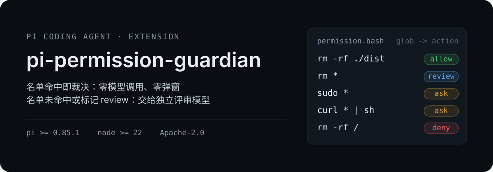
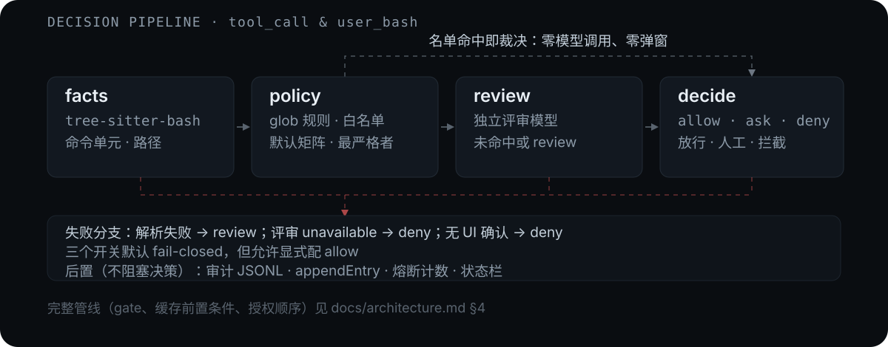

# pi-permission-guardian

<p align="center">
  
</p>

<p align="center">
  
  
  
  
</p>

pi agent 的命令执行护栏插件：**黑白名单快速裁决 + 名单外/需复查项交由模型判定**，在高风险操作与跨工作目录读写场景下减少人工介入。斜杠命令为 `/perm`。

> 状态：**M0~M7 全部实现**（配置加载/合并/规范化、`/perm` 命令、会话状态与审计日志、tree-sitter 事实提取、glob 规则求值、跨层最严格者合并、会话授权、`tool_call` 与 `user_bash` 端到端裁决、独立评审模型接入与 FR-23 风险门槛、判定缓存/熔断/预评分三项降本机制、子代理会话识别与 `subagentPolicy`、pi package 打包与内容门禁）。哪些环节在真实 pi 会话里验证过、哪些没有，见[验证状态](#验证状态)。

## 真实会话里的裁决

配置里写什么就裁什么。下表三条观察来自 Windows 11 + pi 0.85.1 的真实会话，出处 [`docs/smoke-test.md`](docs/smoke-test.md) §3.5~§3.7：

| 会话里的动作 | 命中的规则 | 观察到的结果 |
|---|---|---|
| `ls -la` | 内置只读命令白名单（FR-9） | `decision: allow, source: policy`，命令真实执行，全程**零模型调用** |
| `rm -rf ./dist` | 项目层 `"rm -rf ./dist*": "deny"` | `decision: deny, source: policy, matchedPattern: rm -rf ./dist*`；返回 `exitCode: 1`，`dist/sentinel.txt` 仍然存在——**拦截发生在工具执行前** |
| 未配置 `reviewer.model` 时的任意非白名单命令 | 默认动作 `review`，评审不可用 | `decision: deny, source: policy, verdict: unavailable`，理由明确写"评审未完成……**不代表该动作因风险被拒绝**" |

每条裁决同时写入会话条目与 JSONL 审计日志（真实样例，`reason` 已截断）：

```json
{"ts":"…","sessionId":"…","toolCallId":"user_bash#2","callIndex":2,"toolName":"bash","surface":"bash","targets":["rm -rf ./dist"],"matchedPattern":"rm -rf ./dist*","action":"deny","source":"policy","latencyMs":2,"reason":"命中规则 …"}
{"ts":"…","sessionId":"…","toolCallId":"user_bash#1","callIndex":1,"toolName":"bash","surface":"bash","targets":["echo hello-guardian"],"matchedPattern":"*","action":"deny","source":"policy","latencyMs":26,"reason":"评审模型未配置或无法解析…","verdict":"unavailable"}
```

`/perm status` 一条命令回答"当前规则集是什么、评审是否可用、tree-sitter 是否就绪"（真实输出节选，出处同上 §3.4）：

```text
- 总开关：开（config.enabled）｜--perm：否｜会话覆盖：无｜实际：参与裁决
- 配置版本：1｜规则：用户 0 条 + 合成默认 11 条
- 项目配置：<cwd>/.pi/extensions/pi-permission-guardian/config.json｜状态 loaded｜surface 1 个｜规则 1 条
- 评审模型：未配置（需要评审时判为 unavailable，按 onReviewUnavailable 处理）
- bash 解析器：未就绪（命令会按不可静态展开处理）
- 计数器：grants 0｜cache 0（TTL 300000ms / 上限 200）｜熔断 连续 0 / 窗口 0
- 失败分支：onReviewUnavailable=deny onUnresolvedFacts=review onAskWithoutUI=deny onMixedCommandActions=deny
```

## 工作方式

<p align="center">
  
</p>

- **名单命中即裁决**：glob 规则与只读命令白名单命中时直接放行或拦截，零模型调用、零弹窗。
- **名单外交给评审**：由配置 `reviewer.model` 指定的独立评审模型判断。它只能来自 pi 模型配置文件并经 model registry 使用，插件不自行选择接口协议，也不覆盖 `baseUrl`、认证与 headers（D6）。
- **模型结论之上还有底线**：`allow` 且风险等级超过 `reviewer.maxAllowRiskLevel`（默认 `medium`）时转人工确认，`deny` 直接拦截；`deny` 不提供当场申诉通道，改配置才是正解（D12 / D16）。
- **不确定落到安全分支**：解析失败、评审超时/不可用、输出非法都走已知的安全分支，绝不静默放行；理由文本会写明"评审未完成"，避免 agent 学到错误结论（FR-27）。
- **规则语义**：同一作用域内后写的规则覆盖先写的（last-match-wins，所以具体规则必须写在宽泛规则之后）；跨作用域合并取最严格者 `deny > ask > review > allow`（FR-5 / FR-6）。

为什么不是"纯黑白名单"或"纯模型判定"（[`docs/requirements.md`](docs/requirements.md) §1）：静态名单要人工穷举，未命中项只能"放行"（等于没有护栏）或"每次询问"（等于每次弹窗）；逐次模型判定则给每个常规操作都加上模型延迟与费用，且缺少"这条绝对不行"的硬约束。本插件把两者串成一条链：名单裁决掉绝大多数调用，只有名单未覆盖或显式标记 `review` 的调用才付出模型成本。

## 安装

需要 pi ≥ 0.85.1 与 Node ≥ 22（`engines`）。`zod` 与事实层的 `tree-sitter-bash` / `web-tree-sitter` 是 `dependencies`，pi 安装时会一并装好；pi 核心包（`@earendil-works/pi-*`、`typebox`）是 `peerDependencies`，由宿主提供。

| 方式 | 命令 | 写入位置 |
|---|---|---|
| npm（`latest`） | `pi install npm:pi-permission-guardian` | `<agentDir>/settings.json` |
| git（ref 固定） | `pi install git:github.com/deqiying/pi-permission-guardian@v0.1.1` | `<agentDir>/settings.json` |
| 本地路径 | `pi install /absolute/path/to/pi-permission-guardian` | `<agentDir>/settings.json`，只引用不复制 |
| 项目级 | 以上任一命令加 `-l` | `<cwd>/.pi/settings.json`，随仓库共享；项目需被信任 |
| 只试用不安装 | `pi -e /absolute/path/to/pi-permission-guardian` | 仅本次运行（临时目录） |

安装后用 `pi list` 确认已登记；进入会话用 `/perm status` 自检（开关、配置来源与规则条数、评审模型可用性、parser 状态、`user_bash` 冲突、子代理覆盖、计数器与审计路径）。`/reload` 只对自动发现位置的扩展生效，`pi -e` 临时加载的扩展不支持热重载。

两个已知的显示语义（不是缺陷）：`bash 解析器：未就绪` 说明还没有发生模型轮次（预热在 `before_agent_start`，此时命令按不可静态展开处理）；`subagentCoverage：未识别，使用父策略` 是普通会话的预期值。

### 卸载

```bash
pi remove npm:pi-permission-guardian       # 用户级设置
pi remove -l npm:pi-permission-guardian    # 项目级设置（项目未信任时加 -a）
```

`pi remove` 只改设置文件：插件自己的配置与审计日志位于 `<agentDir>/extensions/pi-permission-guardian/`，不会被删除；要彻底清理请手动删除该目录（只清日志就删其中的 `logs/`）。只想临时恢复无护栏行为则用 `/perm off`（仅本会话，立即生效，不动任何文件）。

## 配置

参考配置：[`config/config.json`](config/config.json) —— **严格 JSON**，带 `$schema`，编辑器可直接补全与实时校验。

逐字段讲解示例：[`config/config.example.jsonc`](config/config.example.jsonc) —— 每个字段都带 `//` 说明，取值与默认值一致（规则表只列代表项，完整清单见参考配置）。

| 作用域 | 路径 | 生效条件 |
|---|---|---|
| 全局 | `<agentDir>/extensions/pi-permission-guardian/config.json` | 始终加载 |
| 项目 | `<cwd>/.pi/extensions/pi-permission-guardian/config.json` | 仅当项目被信任（`ctx.isProjectTrusted()`） |

**你手写的配置可以带注释与尾逗号**（`config.example.jsonc` 就是这样的文件，去掉注释即为合法配置）；官方参考配置不带注释，是为了让 `$schema` 保持有效——活的 schema 比死的注释更有用。理由与取舍见 [docs/configuration.md §1](docs/configuration.md)。

跨作用域合并时**最严格者胜**（`deny > ask > review > allow`）；同一作用域内**后写的规则覆盖先写的**（last-match-wins，所以具体规则必须写在宽泛规则之后）。

Schema：[`schemas/guardian.schema.json`](schemas/guardian.schema.json)。

### `/perm` 子命令

| 子命令 | 行为 |
|---|---|
| `/perm`、`/perm status` | 打印完整自检报告：总开关、配置路径与状态、规则条数、评审模型可用性、`userBashPolicy` / 子代理覆盖、grants / cache / 熔断计数、审计日志 |
| `/perm on` / `/perm off` | 仅本会话启用/停用护栏，优先于配置总开关与 `--perm` |
| `/perm reload` | 重新读盘、重新合并配置，规则条数与配置版本号会在 `status` 中变化 |
| `/perm grants` | 列出本会话的人工授权记忆（仅内存，会话结束失效） |
| `/perm clear-grants` | 清空本会话的授权记忆 |

`--perm` 命令行 flag 可在配置 `enabled: false` 时仍让会话参与裁决；实际是否生效按 `会话覆盖 > --perm / config.enabled` 的顺序决定。

## 已知限制

本插件是**策略护栏，不是沙箱**（需求 N1）：它只裁决 pi 发起的工具调用，不对操作系统做隔离，也不阻止其他进程。已知边界：

- **静态分析的固有限制**：shell 别名不展开、`eval` / `bash -c` 内部字符串无法静态得知、非字面 `cd` 之后的相对路径无法解析、变量拼接的路径不可知；大括号展开与 glob 通配符按字面处理；`~user/x`、`${VAR:-default}`、`$((…))` 不猜值。这些一律标记 `unresolved`，按 `onUnresolvedFacts`（默认 `review`）处理，**不会放行**。
- **没有 PowerShell 解析器**：`powershell` 命令整体不可静态展开，规则最多给到 `review` / `ask`，不会单独给出 `allow` / `deny`。
- **只读白名单是有意的窄集合**：只收逐个核实过没有写文件选项的命令（`pwd` / `ls` / `cat` / `head` / `tail` / `wc` / `git status`，以及按用户决策保留的 `git diff` / `git log` / `git show`）。`git diff --output out.txt`（空格写法、值不像路径）是已知残余面，可用 `"git diff --output*": "review"` 封死。
- **UNC 路径不做 realpath**：`\\server\share\x` 只做词法归一，避免对网络位置发起 SMB 访问而阻塞 `tool_call`。
- **Windows 下日志权限位被忽略**：`0600` 只在 POSIX 生效。
- **`user_bash` 共存只提示不接管**：检测到其他拦截器的声明冲突时会提示，但不调整加载顺序；未参与声明的先前拦截器属于不可观测边界。
- **子代理兼容范围**：v1 只对接 `@gotgenes/pi-subagents` v21.7.1；无法识别子代理会话时保持父策略并告警，`/perm status` 标为 `unguarded`。
- **审计日志异步落盘**：`record()` 只入队，`session_shutdown` 才 flush；进程被强杀时尾部条目可能缺失（影响可追溯性，不影响裁决）。

## 验证状态

| 范围 | 状态 |
|---|---|
| Windows 11 + pi 0.85.1 真实会话 | **已执行**：安装与自动发现加载、`/perm status` 自检、只读放行（S1）、规则拦截（S2）、评审不可用不放行（S6 未配置分支）、非法配置降级、审计落盘、卸载 |
| 需要真实评审模型 / 交互弹窗 / 真实子代理会话 | **未执行**：S3（名单外命令交评审）、S4（跨目录读写的工具路径）、S5（弹窗与会话授权）、S7（真实子会话）、`--perm` flag 与 TUI 状态栏外观 |
| Linux / macOS 真实会话 | **未验证**：CI 在双平台只跑 typecheck / test / 打包校验，不跑真实 pi 会话 |
| 自动化门禁 | `typecheck` → `test` → `validate:config` → `check:pack` 由 CI 在两个平台执行（命令与触发方式见[开发](#开发)） |

逐项清单、复现步骤与未覆盖场景见 [`docs/smoke-test.md`](docs/smoke-test.md)。

## 文档

| 文档 | 内容 |
|---|---|
| [docs/requirements.md](docs/requirements.md) | 背景、目标与非目标、用户场景、功能需求（FR-1~FR-62）、设计决策（D1~D25）、约束与已知限制 |
| [docs/architecture.md](docs/architecture.md) | 模块划分、决策管线、事实提取、规则引擎、评审器、降本机制、失败语义矩阵、打包与测试策略 |
| [docs/configuration.md](docs/configuration.md) | 全部配置字段的语义、规则编排顺序、surface 与默认动作矩阵 |
| [docs/implementation-plan.md](docs/implementation-plan.md) | M0~M7 实施顺序、逐阶段文件范围、测试门禁与完成定义 |
| [docs/smoke-test.md](docs/smoke-test.md) | M7 手动冒烟记录：S1~S7 的复现步骤、已观察结果、待人工场景与未验证边界 |

## 开发

| 命令 | 用途 |
|---|---|
| `npm run typecheck` | 严格 TypeScript 检查（含测试与脚本） |
| `npm test` | vitest 单元测试 |
| `npm run gen:schema` | 从 `src/config/schema.ts`（zod 唯一真源）重新生成 `schemas/guardian.schema.json` |
| `npm run validate:config` | 校验官方参考配置是严格 JSON、且同时通过 zod 与提交版 schema |
| `npm run check:pack` | 执行 `npm pack --dry-run` 并断言 tarball 内容：必需文件、入口的相对 import 闭包、不含仓库专属目录，同时检测提交版 schema 是否被 `prepack` 就地修过 |

修改配置结构时必须先改 zod schema，再跑 `gen:schema`；提交版 schema 与生成结果不一致时测试会失败（FR-57）。`prepack` 会在打包前重新生成 schema，因此 `check:pack` 在 CI 里排在最后。

运行时依赖是 `zod`（配置 schema 唯一真源）与 `tree-sitter-bash` / `web-tree-sitter`（bash 事实提取）；pi 相关包均为 `peerDependencies`，由宿主提供。

CI（[`.github/workflows/ci.yml`](.github/workflows/ci.yml)）在 `ubuntu-latest` 与 `windows-latest` 上依次执行 `typecheck` → `test` → `validate:config` → `check:pack`；触发方式是**推送发布版本 tag（`v*`）**，PR 与 `main` 直推不触发，所以推送前请在本地跑完同一组命令。真实 pi 会话冒烟不在 CI 内，属于交付前的人工门禁。

发布也随这条链走：verify 双腿全绿后，`publish` job 用 npm trusted publishing（OIDC）把 tag 对应的版本发出去，不需要长期 token，provenance 自动生成。npm 侧的一次性配置、首次演练与失败重跑见 [`docs/release.md`](docs/release.md)。

仓库用 [`.gitattributes`](.gitattributes) 把文本文件统一钉在 LF：schema 漂移门禁用例是字节比对，Windows 上被 `core.autocrlf` 转成 CRLF 会导致假失败。

## 许可证

本项目使用 Apache License 2.0，全文见 [`LICENSE`](LICENSE)。

